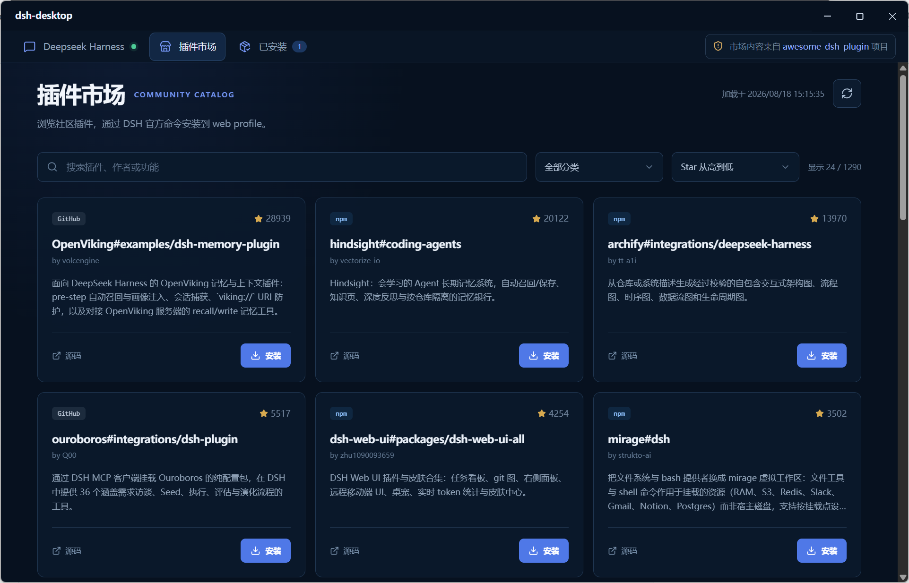

# deepseek-harness-desktop

[English](README_EN.md)

`deepseek-harness-desktop` 是官方 DeepSeek Harness Web UI 的轻量桌面外壳，负责启动与更新检查，并提供社区插件管理和系统通知集成。模型凭据、会话及插件配置仍由 DSH 管理。

## 插件市场

市场数据来自 [`awesome-dsh-plugin`](https://github.com/awesome-dsh-plugin/awesome-dsh-plugin) 项目，支持搜索、分类筛选和按 Star 数量排序，并明确标识 npm 或 GitHub 来源。

安装和卸载最终由 DSH 官方的 `dsh plugin --profile web` 命令完成，操作前会请求确认，并在需要时重新启动 DSH。对于需要执行 `prepare` 脚本的 GitHub 插件，桌面端会再次确认仓库和提交后才允许构建。

应用每次启动都会检查一次已安装插件的更新：npm 插件比较最新版本，GitHub 插件比较远端提交。待更新数量显示在“已安装”Tab 上并保存在本地；本次检测不可用时会保留上次结果。检测不会自动升级插件。

市场内容来自社区，不代表 DeepSeek 官方审核或推荐，请仅安装可信插件。

## 通知中心集成

安装 [`dsh-notify-center`](https://github.com/SingleOne/dsh-notify-center) 后，桌面端会通过仅监听 `127.0.0.1` 的认证桥接显示 Electron 系统通知，并在点击通知时恢复窗口和定位会话。桥接不可用时，插件会回退到自身的系统通知实现。



## 运行要求

桌面端需要系统中已安装 Node.js 22.13 或更高版本及 npm。macOS App 会读取登录 Shell 的 PATH，因此可以识别通过 Homebrew、nvm 等常见方式安装的 Node.js。

## 开发

需要 Node.js 和 npm。

```powershell
npm install
npm run dev
```

```powershell
npm run dev:debug
npm run check
npm run package:win
npm run package:mac
```

`package:mac` 需要在 macOS 上运行，会在 `release` 目录分别生成 Apple Silicon（arm64）和 Intel（x64）的 DMG。对外分发时还需要配置 Apple Developer ID 签名和 notarization。

## 鸣谢

[linux.do](https://linux.do)
